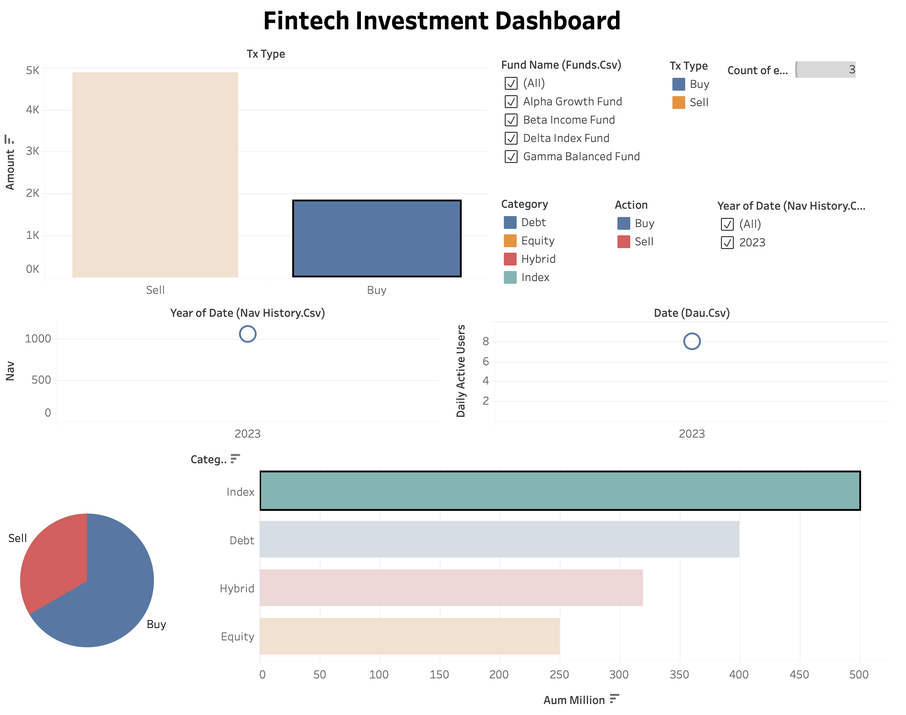

# Fintech Dashboard Project

## Project Overview
A modern, interactive fintech dashboard built with Tableau. Visualizes key financial metrics and user behavior, turning raw data into actionable insights for a business-centric audience.

## Tools and Technologies
* **Tableau Public:** Used for data joining, visualization, and creating the interactive dashboard.
* **GitHub:** Used to host the project files for portfolio and collaboration purposes.

## Data Source
The analysis is based on a set of simulated fintech data in CSV format, including:
* `aum_by_fund.csv`: Assets Under Management for each fund.
* `dau.csv`: Daily Active Users.
* `engagement.csv`: User actions and duration.
* `funds.csv`: Fund details and categories.
* `nav_history.csv`: Historical Net Asset Value (NAV) for each fund.
* `transactions.csv`: User transaction data.

## Key Visualizations
The dashboard includes the following interactive charts to provide a comprehensive overview:
* **Fund Performance Over Time:** A line chart showing the historical Net Asset Value (NAV) of selected funds.
* **AUM by Fund:** A bar chart comparing the total Assets Under Management (AUM) for various funds, color-coded by fund category.
* **Daily Active Users (DAU):** A line chart tracking user engagement trends over time.
* **User Actions Breakdown:** A bar chart visualizing the frequency of different user actions, such as "Buy," "Sell," and "View Fund."

## Key Insights
* **Fund Popularity:** The Delta Index Fund has the highest Assets Under Management, making it the most popular fund in the dataset.
* **User Engagement:** User activity shows an increasing trend, with a high frequency of "Buy" and "View Fund" actions.
* **Data-Driven Decisions:** The interactive nature of the dashboard allows a user to filter by fund, date, or action to uncover specific insights and guide business decisions.

**Note:** The dataset contains a limited date range from early 2023. The dashboard is designed to be scalable and can be updated with new data by simply replacing the CSV files.

---

**[Link to live Tableau Public Dashboard](https://public.tableau.com/shared/77F3WT2FS?:display_count=n&:origin=viz_share_link)**
